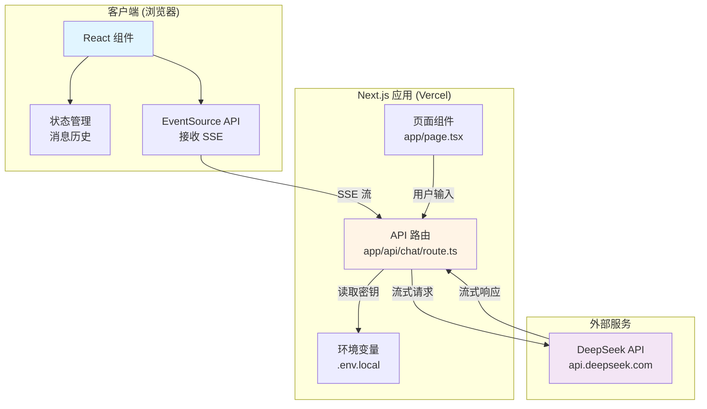
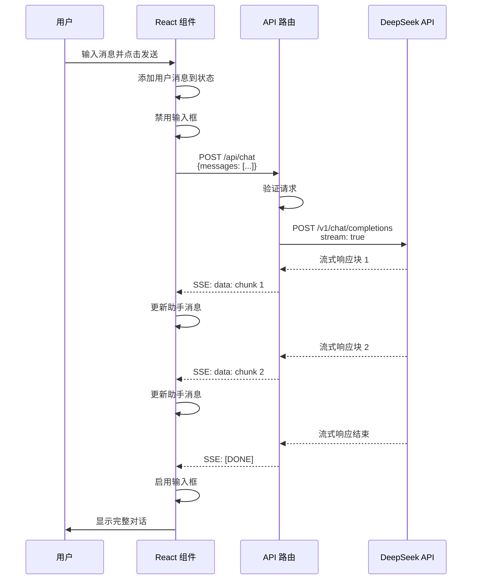
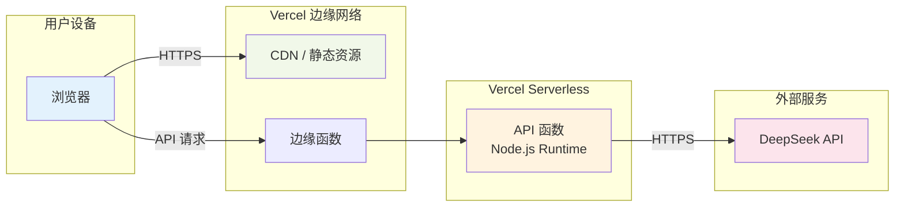
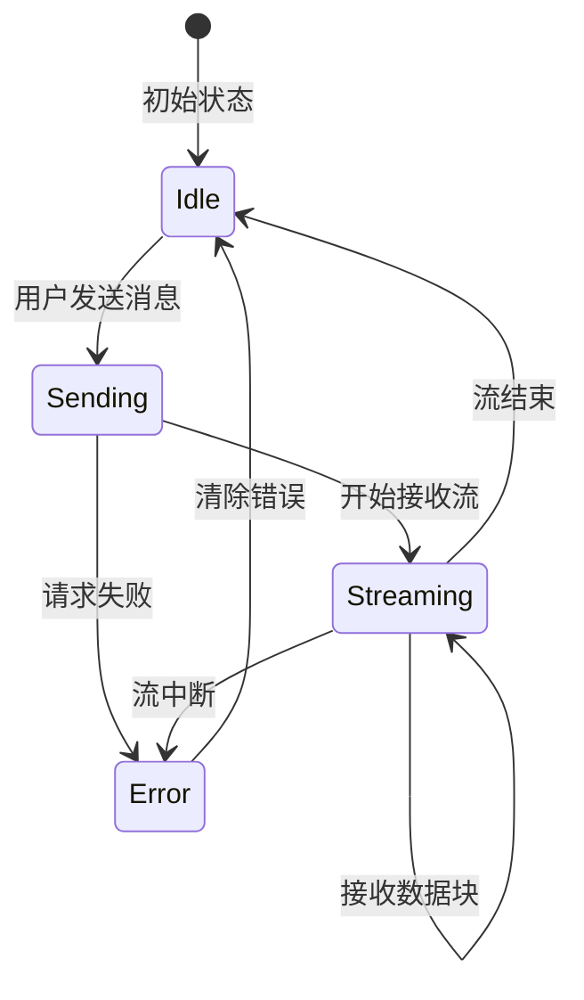

# Design Document

## Overview

### 系统概述

本设计文档描述了基于 DeepSeek 大模型的智能聊天助手系统的技术架构和实现细节。该系统采用 Next.js 14 App Router 架构，部署在 Vercel 平台，为用户提供实时流式对话体验。

### 核心目标

1. **流畅的用户体验**：通过流式响应技术实现逐字显示 AI 回复，避免长时间等待
2. **可靠的状态管理**：维护完整的对话上下文，确保多轮对话的连贯性
3. **安全的 API 集成**：在服务器端安全调用 DeepSeek API，保护敏感凭证
4. **响应式设计**：支持桌面端和移动端设备的自适应布局

### 技术栈选择

- **前端框架**：Next.js 14+ (App Router)
- **编程语言**：TypeScript
- **AI 服务**：DeepSeek API (OpenAI 兼容端点)
- **部署平台**：Vercel
- **HTTP 流式传输**：Server-Sent Events (SSE) / ReadableStream
- **状态管理**：React Hooks (useState, useEffect)

### 设计原则

1. **服务器端 API 调用**：所有 DeepSeek API 请求必须在服务器端处理，避免暴露 API 密钥
2. **渐进式渲染**：利用流式响应技术逐步显示 AI 生成内容，提升用户感知性能
3. **错误优雅降级**：提供清晰的错误提示和恢复机制
4. **类型安全**：使用 TypeScript 确保编译时类型检查


## Architecture

### 系统架构图



### 架构层次

#### 1. 展示层 (Presentation Layer)

**职责**：
- 渲染用户界面组件
- 处理用户交互事件（输入、发送、滚动）
- 显示消息历史和流式响应
- 提供响应式布局适配

**关键组件**：
- `ChatInterface`：主聊天界面容器
- `MessageList`：消息列表展示组件
- `MessageInput`：消息输入框组件
- `StreamingIndicator`：流式加载指示器

#### 2. 应用层 (Application Layer)

**职责**：
- 管理应用状态（消息历史、加载状态）
- 协调客户端与服务器端交互
- 处理流式数据接收和状态更新
- 实现错误处理和用户反馈

**关键逻辑**：
- 消息发送逻辑
- SSE 连接管理
- 状态更新策略
- 错误处理流程


#### 3. API 层 (API Layer)

**职责**：
- 接收客户端请求
- 验证输入数据
- 调用 DeepSeek API
- 转发流式响应到客户端
- 处理 API 错误和异常

**端点设计**：
- `POST /api/chat`：处理聊天请求，返回 SSE 流

#### 4. 集成层 (Integration Layer)

**职责**：
- 封装 DeepSeek API 调用
- 管理 API 认证
- 处理流式响应转换
- 实现重试和超时机制

### 数据流

#### 用户发送消息流程




### 部署架构



**部署特点**：

1. **静态资源**：React 组件编译后的 JavaScript/CSS 通过 Vercel CDN 分发
2. **API 函数**：API 路由部署为 Serverless 函数，按需冷启动
3. **环境变量**：通过 Vercel 项目设置注入，不包含在构建产物中
4. **自动扩缩容**：Vercel 根据流量自动调整函数实例数量


## Components and Interfaces

### 前端组件结构

#### 1. ChatInterface（主容器组件）

**文件位置**：`app/page.tsx`

**职责**：
- 作为页面的根组件
- 管理全局消息状态
- 协调子组件交互
- 处理流式响应接收

**状态定义**：

```typescript
interface Message {
  role: 'user' | 'assistant';
  content: string;
  timestamp: number;
}

interface ChatState {
  messages: Message[];
  isLoading: boolean;
  error: string | null;
  streamingContent: string;
}
```

**关键方法**：

```typescript
// 发送消息到 API
async function handleSendMessage(userInput: string): Promise<void>

// 处理 SSE 流式响应
function handleStreamResponse(response: Response): Promise<void>

// 添加消息到历史
function addMessage(message: Message): void

// 清空错误状态
function clearError(): void
```


#### 2. MessageList（消息列表组件）

**文件位置**：`components/MessageList.tsx`

**职责**：
- 渲染消息列表
- 区分用户和助手消息的视觉样式
- 自动滚动到最新消息
- 显示流式内容加载状态

**Props 接口**：

```typescript
interface MessageListProps {
  messages: Message[];
  streamingContent: string;
  isStreaming: boolean;
}
```

**样式要求**：
- 用户消息：右对齐，蓝色背景
- 助手消息：左对齐，灰色背景
- 流式内容：显示闪烁光标或加载动画
- 滚动行为：使用 `scrollIntoView` 平滑滚动

#### 3. MessageInput（输入组件）

**文件位置**：`components/MessageInput.tsx`

**职责**：
- 提供文本输入框
- 处理发送按钮点击和回车键事件
- 根据状态禁用/启用输入
- 验证输入非空

**Props 接口**：

```typescript
interface MessageInputProps {
  onSend: (message: string) => void;
  disabled: boolean;
  placeholder?: string;
}
```

**交互逻辑**：
- 回车键：触发发送（Shift+回车换行）
- 发送按钮：仅在输入非空且未禁用时可点击
- 发送后：清空输入框内容


#### 4. ErrorMessage（错误提示组件）

**文件位置**：`components/ErrorMessage.tsx`

**职责**：
- 显示错误信息
- 提供关闭按钮
- 支持不同错误级别的样式

**Props 接口**：

```typescript
interface ErrorMessageProps {
  message: string;
  onClose: () => void;
  type?: 'error' | 'warning' | 'info';
}
```

### 后端 API 接口

#### API 路由：POST /api/chat

**文件位置**：`app/api/chat/route.ts`

**请求格式**：

```typescript
interface ChatRequest {
  messages: Array<{
    role: 'user' | 'assistant';
    content: string;
  }>;
}
```

**响应格式**：Server-Sent Events (SSE) 流

```
event: message
data: {"delta": "你"}

event: message
data: {"delta": "好"}

event: done
data: [DONE]
```


**实现逻辑**：

```typescript
export async function POST(request: Request) {
  // 1. 解析请求体
  const { messages } = await request.json();
  
  // 2. 验证请求
  if (!Array.isArray(messages) || messages.length === 0) {
    return new Response('Invalid request', { status: 400 });
  }
  
  // 3. 调用 DeepSeek API
  const response = await fetch('https://api.deepseek.com/v1/chat/completions', {
    method: 'POST',
    headers: {
      'Content-Type': 'application/json',
      'Authorization': `Bearer ${process.env.DEEPSEEK_API_KEY}`
    },
    body: JSON.stringify({
      model: 'deepseek-chat',
      messages,
      stream: true
    })
  });
  
  // 4. 转发流式响应
  const encoder = new TextEncoder();
  const stream = new ReadableStream({
    async start(controller) {
      const reader = response.body?.getReader();
      // ... 处理流式数据
    }
  });
  
  return new Response(stream, {
    headers: {
      'Content-Type': 'text/event-stream',
      'Cache-Control': 'no-cache',
      'Connection': 'keep-alive'
    }
  });
}
```


### DeepSeek API 集成接口

#### API 端点

- **基础 URL**：`https://api.deepseek.com`
- **聊天端点**：`/v1/chat/completions`
- **兼容性**：OpenAI Chat Completions API

#### 请求参数

```typescript
interface DeepSeekChatRequest {
  model: 'deepseek-chat' | 'deepseek-v4-flash' | 'deepseek-v4-pro';
  messages: Array<{
    role: 'system' | 'user' | 'assistant';
    content: string;
  }>;
  stream: boolean;
  temperature?: number;  // 0-2, 默认 1
  max_tokens?: number;
  top_p?: number;       // 0-1, 默认 1
}
```

#### 流式响应格式

DeepSeek API 返回的每个数据块格式为：

```
data: {"id":"chatcmpl-xxx","object":"chat.completion.chunk","created":1234567890,"model":"deepseek-chat","choices":[{"index":0,"delta":{"content":"你"},"finish_reason":null}]}

data: {"id":"chatcmpl-xxx","object":"chat.completion.chunk","created":1234567890,"model":"deepseek-chat","choices":[{"index":0,"delta":{"content":"好"},"finish_reason":null}]}

data: [DONE]
```

**关键字段**：
- `choices[0].delta.content`：当前文本块内容
- `choices[0].finish_reason`：结束原因（`null` 表示继续，`stop` 表示完成）
- `[DONE]`：流结束标记


## Data Models

### 核心数据模型

#### Message（消息模型）

```typescript
interface Message {
  /** 消息角色 */
  role: 'user' | 'assistant' | 'system';
  
  /** 消息内容 */
  content: string;
  
  /** 时间戳（毫秒） */
  timestamp: number;
  
  /** 唯一标识符（可选） */
  id?: string;
}
```

**使用场景**：
- 存储在 React 状态中的消息历史
- 发送给 DeepSeek API 的消息列表
- 渲染在界面上的消息项

**验证规则**：
- `role` 必须为枚举值之一
- `content` 不能为空字符串
- `timestamp` 必须为正整数

#### ChatState（聊天状态模型）

```typescript
interface ChatState {
  /** 消息历史列表 */
  messages: Message[];
  
  /** 当前流式内容缓冲 */
  streamingContent: string;
  
  /** 是否正在加载 */
  isLoading: boolean;
  
  /** 错误信息（null 表示无错误） */
  error: string | null;
  
  /** 是否正在流式传输 */
  isStreaming: boolean;
}
```

**状态转换**：




#### APIError（API 错误模型）

```typescript
interface APIError {
  /** HTTP 状态码 */
  statusCode: number;
  
  /** 错误消息 */
  message: string;
  
  /** 错误类型 */
  type: 'network' | 'auth' | 'rate_limit' | 'server' | 'unknown';
  
  /** 原始错误对象（可选） */
  originalError?: Error;
}
```

**错误类型映射**：

| HTTP 状态码 | 错误类型 | 用户提示消息 |
|------------|---------|-------------|
| 401 | auth | API 密钥无效，请检查配置 |
| 429 | rate_limit | 请求过于频繁，请稍后再试 |
| 500, 502, 503 | server | 服务暂时不可用，请稍后再试 |
| 网络错误 | network | 网络连接失败，请检查您的网络设置 |
| 其他 | unknown | 发生未知错误，请重试 |

#### StreamChunk（流数据块模型）

```typescript
interface StreamChunk {
  /** 增量文本内容 */
  delta: string;
  
  /** 是否为最后一块 */
  isDone: boolean;
  
  /** 完成原因（可选） */
  finishReason?: 'stop' | 'length' | 'error';
}
```

**解析逻辑**：

```typescript
function parseStreamChunk(rawData: string): StreamChunk | null {
  if (rawData === '[DONE]') {
    return { delta: '', isDone: true };
  }
  
  try {
    const json = JSON.parse(rawData);
    const delta = json.choices[0]?.delta?.content || '';
    const finishReason = json.choices[0]?.finish_reason;
    
    return {
      delta,
      isDone: finishReason !== null,
      finishReason
    };
  } catch (error) {
    return null;
  }
}
```


### 环境变量模型

#### EnvironmentConfig（环境配置模型）

```typescript
interface EnvironmentConfig {
  /** DeepSeek API 密钥 */
  DEEPSEEK_API_KEY: string;
  
  /** DeepSeek API 基础 URL（可选，默认官方地址） */
  DEEPSEEK_API_BASE_URL?: string;
  
  /** 默认使用的模型（可选） */
  DEEPSEEK_MODEL?: 'deepseek-chat' | 'deepseek-v4-flash' | 'deepseek-v4-pro';
  
  /** API 请求超时时间（毫秒，可选） */
  API_TIMEOUT?: number;
}
```

**配置文件示例**（`.env.local`）：

```env
DEEPSEEK_API_KEY=sk-xxxxxxxxxxxxxxxxxxxxxxxx
DEEPSEEK_API_BASE_URL=https://api.deepseek.com
DEEPSEEK_MODEL=deepseek-chat
API_TIMEOUT=30000
```

**验证逻辑**：

```typescript
function validateEnvironmentConfig(): void {
  if (!process.env.DEEPSEEK_API_KEY) {
    throw new Error('缺少必需的环境变量：DEEPSEEK_API_KEY');
  }
  
  if (process.env.DEEPSEEK_API_KEY.length < 20) {
    throw new Error('DEEPSEEK_API_KEY 格式无效');
  }
}
```


## Error Handling

### 错误处理策略

本系统采用分层错误处理机制，确保错误在合适的层级被捕获和处理。

#### 1. 客户端错误处理

**输入验证错误**

```typescript
function validateUserInput(input: string): ValidationResult {
  if (input.trim().length === 0) {
    return {
      valid: false,
      error: '消息内容不能为空'
    };
  }
  
  if (input.length > 4000) {
    return {
      valid: false,
      error: '消息长度不能超过 4000 字符'
    };
  }
  
  return { valid: true };
}
```

**网络请求错误**

```typescript
async function handleSendMessage(userInput: string) {
  try {
    const response = await fetch('/api/chat', {
      method: 'POST',
      headers: { 'Content-Type': 'application/json' },
      body: JSON.stringify({ messages })
    });
    
    if (!response.ok) {
      throw new APIError(response.status, await response.text());
    }
    
    // 处理流式响应...
  } catch (error) {
    if (error instanceof APIError) {
      handleAPIError(error);
    } else if (error instanceof TypeError) {
      setError('网络连接失败，请检查您的网络设置');
    } else {
      setError('发生未知错误，请重试');
    }
  }
}
```


**流式响应中断处理**

```typescript
async function handleStreamResponse(response: Response) {
  const reader = response.body?.getReader();
  const decoder = new TextDecoder();
  
  try {
    while (true) {
      const { done, value } = await reader.read();
      
      if (done) break;
      
      const chunk = decoder.decode(value, { stream: true });
      processStreamChunk(chunk);
    }
  } catch (error) {
    console.error('流式响应中断:', error);
    setError('接收响应时发生错误，请重试');
    setIsStreaming(false);
  } finally {
    reader.releaseLock();
  }
}
```

#### 2. API 路由错误处理

**请求验证错误**

```typescript
export async function POST(request: Request) {
  try {
    const body = await request.json();
    
    if (!body.messages || !Array.isArray(body.messages)) {
      return new Response(
        JSON.stringify({ error: '请求格式无效' }),
        { status: 400, headers: { 'Content-Type': 'application/json' } }
      );
    }
    
    if (body.messages.length === 0) {
      return new Response(
        JSON.stringify({ error: '消息列表不能为空' }),
        { status: 400, headers: { 'Content-Type': 'application/json' } }
      );
    }
    
    // 继续处理...
  } catch (error) {
    return new Response(
      JSON.stringify({ error: '解析请求失败' }),
      { status: 400, headers: { 'Content-Type': 'application/json' } }
    );
  }
}
```


**DeepSeek API 调用错误**

```typescript
async function callDeepSeekAPI(messages: Message[]) {
  const apiKey = process.env.DEEPSEEK_API_KEY;
  
  if (!apiKey) {
    throw new Error('服务器配置错误：缺少 API 密钥');
  }
  
  try {
    const response = await fetch('https://api.deepseek.com/v1/chat/completions', {
      method: 'POST',
      headers: {
        'Content-Type': 'application/json',
        'Authorization': `Bearer ${apiKey}`
      },
      body: JSON.stringify({
        model: process.env.DEEPSEEK_MODEL || 'deepseek-chat',
        messages,
        stream: true
      }),
      signal: AbortSignal.timeout(30000) // 30 秒超时
    });
    
    if (!response.ok) {
      const errorBody = await response.text();
      throw new APIError(response.status, errorBody);
    }
    
    return response;
  } catch (error) {
    if (error.name === 'AbortError') {
      throw new Error('请求超时，请重试');
    }
    throw error;
  }
}
```

**错误响应格式**

API 路由返回的错误响应应遵循统一格式：

```typescript
interface ErrorResponse {
  error: string;
  code?: string;
  details?: any;
}
```

示例：

```json
{
  "error": "API 密钥无效，请检查配置",
  "code": "INVALID_API_KEY",
  "details": {
    "statusCode": 401
  }
}
```


#### 3. 环境配置错误处理

**启动时验证**

在应用启动时验证必需的环境变量：

```typescript
// middleware.ts 或 API 路由入口
function validateEnvironment() {
  const requiredEnvVars = ['DEEPSEEK_API_KEY'];
  const missing = requiredEnvVars.filter(key => !process.env[key]);
  
  if (missing.length > 0) {
    throw new Error(
      `缺少必需的环境变量：${missing.join(', ')}\n` +
      '请在 .env.local 文件中配置这些变量'
    );
  }
}
```

**运行时配置错误**

```typescript
function getAPIConfig(): APIConfig {
  const apiKey = process.env.DEEPSEEK_API_KEY;
  
  if (!apiKey) {
    console.error('DEEPSEEK_API_KEY 未设置');
    throw new Error('服务器配置错误');
  }
  
  return {
    apiKey,
    baseURL: process.env.DEEPSEEK_API_BASE_URL || 'https://api.deepseek.com',
    model: process.env.DEEPSEEK_MODEL || 'deepseek-chat',
    timeout: parseInt(process.env.API_TIMEOUT || '30000', 10)
  };
}
```

### 错误恢复机制

#### 自动重试策略

对于可恢复的错误（如网络暂时中断），实现指数退避重试：

```typescript
async function fetchWithRetry(
  url: string,
  options: RequestInit,
  maxRetries: number = 3
): Promise<Response> {
  let lastError: Error;
  
  for (let i = 0; i < maxRetries; i++) {
    try {
      return await fetch(url, options);
    } catch (error) {
      lastError = error;
      
      if (i < maxRetries - 1) {
        const delay = Math.min(1000 * Math.pow(2, i), 10000);
        await new Promise(resolve => setTimeout(resolve, delay));
      }
    }
  }
  
  throw lastError;
}
```


#### 用户反馈机制

**错误提示原则**：

1. **清晰性**：使用用户可理解的语言描述错误
2. **可操作性**：提供明确的解决建议
3. **非侵入性**：使用 toast 或内联提示，不阻塞操作
4. **可关闭性**：允许用户手动关闭错误提示

**错误提示映射表**：

| 错误场景 | 用户提示 | 技术日志 |
|---------|---------|---------|
| 网络连接失败 | 网络连接失败，请检查您的网络设置 | `NetworkError: fetch failed` |
| API 密钥无效 | API 密钥无效，请联系管理员 | `401 Unauthorized` |
| 请求频率限制 | 请求过于频繁，请稍后再试 | `429 Too Many Requests` |
| 服务器错误 | 服务暂时不可用，请稍后再试 | `500 Internal Server Error` |
| 请求超时 | 请求超时，请重试 | `AbortError: timeout` |
| 输入过长 | 消息长度不能超过 4000 字符 | `Validation error: content too long` |
| 空输入 | 消息内容不能为空 | `Validation error: empty content` |

### 日志记录

#### 客户端日志

```typescript
function logClientError(error: Error, context: string) {
  console.error(`[客户端错误] ${context}:`, {
    message: error.message,
    stack: error.stack,
    timestamp: new Date().toISOString()
  });
  
  // 可选：发送到错误追踪服务（如 Sentry）
}
```

#### 服务器端日志

```typescript
function logServerError(error: Error, request: Request) {
  console.error('[服务器错误]', {
    error: error.message,
    stack: error.stack,
    url: request.url,
    method: request.method,
    timestamp: new Date().toISOString()
  });
}
```


## Testing Strategy

### 测试策略概述

本系统采用多层次测试策略，结合单元测试、集成测试、端到端测试和快照测试，确保各个层级的功能正确性和系统稳定性。

**为什么不使用属性测试（Property-Based Testing）**：

根据需求分析，本系统主要包含以下特征：
1. **UI 渲染和交互**：React 组件的渲染逻辑，适合快照测试和交互测试
2. **流式 I/O 操作**：与 DeepSeek API 的流式通信，适合集成测试和模拟测试
3. **状态管理**：React hooks 管理的 UI 状态，适合单元测试和状态转换测试
4. **外部服务集成**：调用第三方 API，适合集成测试和 mock 测试

这些特征均不适合属性测试（PBT），因为：
- UI 渲染不是纯函数，无法定义通用属性
- 流式 I/O 是副作用操作，不适合大量随机输入测试
- 外部 API 调用成本高，无法进行 100+ 次随机测试

因此，我们采用**传统的单元测试和集成测试**策略，针对性地覆盖各种场景。

### 测试层次

#### 1. 单元测试（Unit Tests）

**目标**：测试独立函数和组件的行为

**工具**：Jest + React Testing Library

**测试范围**：

- **数据模型验证函数**
  ```typescript
  describe('validateUserInput', () => {
    it('应拒绝空字符串', () => {
      const result = validateUserInput('');
      expect(result.valid).toBe(false);
      expect(result.error).toBe('消息内容不能为空');
    });
    
    it('应拒绝纯空格字符串', () => {
      const result = validateUserInput('   ');
      expect(result.valid).toBe(false);
    });
    
    it('应拒绝超长消息', () => {
      const longMessage = 'x'.repeat(4001);
      const result = validateUserInput(longMessage);
      expect(result.valid).toBe(false);
    });
    
    it('应接受有效消息', () => {
      const result = validateUserInput('你好');
      expect(result.valid).toBe(true);
    });
  });
  ```


- **流数据解析函数**
  ```typescript
  describe('parseStreamChunk', () => {
    it('应正确解析内容块', () => {
      const rawData = '{"choices":[{"delta":{"content":"你好"},"finish_reason":null}]}';
      const result = parseStreamChunk(rawData);
      
      expect(result).toEqual({
        delta: '你好',
        isDone: false
      });
    });
    
    it('应识别完成信号', () => {
      const result = parseStreamChunk('[DONE]');
      
      expect(result).toEqual({
        delta: '',
        isDone: true
      });
    });
    
    it('应处理格式错误的数据', () => {
      const result = parseStreamChunk('invalid json');
      expect(result).toBeNull();
    });
    
    it('应处理空增量内容', () => {
      const rawData = '{"choices":[{"delta":{},"finish_reason":null}]}';
      const result = parseStreamChunk(rawData);
      
      expect(result.delta).toBe('');
    });
  });
  ```

- **错误分类函数**
  ```typescript
  describe('classifyAPIError', () => {
    it('应将 401 分类为认证错误', () => {
      const error = classifyAPIError(401, 'Unauthorized');
      expect(error.type).toBe('auth');
      expect(error.message).toBe('API 密钥无效，请检查配置');
    });
    
    it('应将 429 分类为频率限制错误', () => {
      const error = classifyAPIError(429, 'Too Many Requests');
      expect(error.type).toBe('rate_limit');
    });
    
    it('应将 5xx 分类为服务器错误', () => {
      expect(classifyAPIError(500, '').type).toBe('server');
      expect(classifyAPIError(502, '').type).toBe('server');
      expect(classifyAPIError(503, '').type).toBe('server');
    });
  });
  ```


#### 2. 组件测试（Component Tests）

**目标**：测试 React 组件的渲染和交互

**工具**：Jest + React Testing Library

**测试范围**：

- **MessageInput 组件**
  ```typescript
  describe('MessageInput', () => {
    it('应在输入为空时禁用发送按钮', () => {
      const { getByRole } = render(<MessageInput onSend={jest.fn()} disabled={false} />);
      const button = getByRole('button');
      
      expect(button).toBeDisabled();
    });
    
    it('应在输入非空时启用发送按钮', async () => {
      const { getByRole } = render(<MessageInput onSend={jest.fn()} disabled={false} />);
      const input = getByRole('textbox');
      const button = getByRole('button');
      
      await userEvent.type(input, '你好');
      expect(button).toBeEnabled();
    });
    
    it('应在按下回车时调用 onSend', async () => {
      const onSend = jest.fn();
      const { getByRole } = render(<MessageInput onSend={onSend} disabled={false} />);
      const input = getByRole('textbox');
      
      await userEvent.type(input, '你好{Enter}');
      expect(onSend).toHaveBeenCalledWith('你好');
    });
    
    it('应在发送后清空输入框', async () => {
      const { getByRole } = render(<MessageInput onSend={jest.fn()} disabled={false} />);
      const input = getByRole('textbox') as HTMLInputElement;
      
      await userEvent.type(input, '你好{Enter}');
      expect(input.value).toBe('');
    });
    
    it('应在 disabled 为 true 时禁用输入', () => {
      const { getByRole } = render(<MessageInput onSend={jest.fn()} disabled={true} />);
      const input = getByRole('textbox');
      
      expect(input).toBeDisabled();
    });
  });
  ```


- **MessageList 组件**
  ```typescript
  describe('MessageList', () => {
    it('应渲染所有消息', () => {
      const messages = [
        { role: 'user', content: '你好', timestamp: Date.now() },
        { role: 'assistant', content: '你好！', timestamp: Date.now() }
      ];
      
      const { getByText } = render(
        <MessageList messages={messages} streamingContent="" isStreaming={false} />
      );
      
      expect(getByText('你好')).toBeInTheDocument();
      expect(getByText('你好！')).toBeInTheDocument();
    });
    
    it('应区分用户和助手消息样式', () => {
      const messages = [
        { role: 'user', content: '测试', timestamp: Date.now() }
      ];
      
      const { container } = render(
        <MessageList messages={messages} streamingContent="" isStreaming={false} />
      );
      
      const userMessage = container.querySelector('.message-user');
      expect(userMessage).toBeInTheDocument();
    });
    
    it('应显示流式内容', () => {
      const { getByText } = render(
        <MessageList messages={[]} streamingContent="正在输入..." isStreaming={true} />
      );
      
      expect(getByText('正在输入...')).toBeInTheDocument();
    });
    
    it('应在流式传输时显示加载指示器', () => {
      const { container } = render(
        <MessageList messages={[]} streamingContent="" isStreaming={true} />
      );
      
      const indicator = container.querySelector('.loading-indicator');
      expect(indicator).toBeInTheDocument();
    });
  });
  ```


#### 3. 集成测试（Integration Tests）

**目标**：测试 API 路由与 DeepSeek API 的集成

**工具**：Jest + MSW (Mock Service Worker)

**测试范围**：

- **API 路由流式响应**
  ```typescript
  describe('POST /api/chat', () => {
    beforeEach(() => {
      // 设置 MSW 模拟 DeepSeek API
      server.use(
        http.post('https://api.deepseek.com/v1/chat/completions', () => {
          const encoder = new TextEncoder();
          const stream = new ReadableStream({
            start(controller) {
              controller.enqueue(encoder.encode('data: {"choices":[{"delta":{"content":"你"}}]}\n\n'));
              controller.enqueue(encoder.encode('data: {"choices":[{"delta":{"content":"好"}}]}\n\n'));
              controller.enqueue(encoder.encode('data: [DONE]\n\n'));
              controller.close();
            }
          });
          
          return new Response(stream, {
            headers: { 'Content-Type': 'text/event-stream' }
          });
        })
      );
    });
    
    it('应成功转发流式响应', async () => {
      const response = await fetch('http://localhost:3000/api/chat', {
        method: 'POST',
        headers: { 'Content-Type': 'application/json' },
        body: JSON.stringify({
          messages: [{ role: 'user', content: '你好' }]
        })
      });
      
      expect(response.ok).toBe(true);
      expect(response.headers.get('Content-Type')).toBe('text/event-stream');
      
      const reader = response.body.getReader();
      const chunks = [];
      
      while (true) {
        const { done, value } = await reader.read();
        if (done) break;
        chunks.push(new TextDecoder().decode(value));
      }
      
      expect(chunks).toContain('你');
      expect(chunks).toContain('好');
    });
  });
  ```


- **错误场景测试**
  ```typescript
  describe('API 错误处理', () => {
    it('应处理 401 认证错误', async () => {
      server.use(
        http.post('https://api.deepseek.com/v1/chat/completions', () => {
          return new Response(JSON.stringify({ error: 'Unauthorized' }), {
            status: 401
          });
        })
      );
      
      const response = await fetch('http://localhost:3000/api/chat', {
        method: 'POST',
        body: JSON.stringify({ messages: [{ role: 'user', content: 'test' }] })
      });
      
      expect(response.status).toBe(401);
      const error = await response.json();
      expect(error.error).toContain('API 密钥无效');
    });
    
    it('应处理 429 频率限制错误', async () => {
      server.use(
        http.post('https://api.deepseek.com/v1/chat/completions', () => {
          return new Response(null, { status: 429 });
        })
      );
      
      const response = await fetch('http://localhost:3000/api/chat', {
        method: 'POST',
        body: JSON.stringify({ messages: [{ role: 'user', content: 'test' }] })
      });
      
      expect(response.status).toBe(429);
    });
    
    it('应拒绝空消息列表', async () => {
      const response = await fetch('http://localhost:3000/api/chat', {
        method: 'POST',
        body: JSON.stringify({ messages: [] })
      });
      
      expect(response.status).toBe(400);
    });
  });
  ```


#### 4. 端到端测试（E2E Tests）

**目标**：测试完整的用户交互流程

**工具**：Playwright 或 Cypress

**测试范围**：

- **完整对话流程**
  ```typescript
  describe('聊天功能 E2E', () => {
    it('应完成完整的发送-接收流程', async () => {
      await page.goto('http://localhost:3000');
      
      // 输入消息
      await page.fill('[data-testid="message-input"]', '你好');
      await page.click('[data-testid="send-button"]');
      
      // 验证用户消息显示
      await expect(page.locator('text=你好')).toBeVisible();
      
      // 验证输入框被禁用
      await expect(page.locator('[data-testid="message-input"]')).toBeDisabled();
      
      // 等待流式响应
      await expect(page.locator('[data-testid="streaming-indicator"]')).toBeVisible();
      
      // 验证助手响应显示
      await expect(page.locator('.message-assistant')).toBeVisible({ timeout: 10000 });
      
      // 验证输入框重新启用
      await expect(page.locator('[data-testid="message-input"]')).toBeEnabled();
    });
    
    it('应支持多轮对话', async () => {
      await page.goto('http://localhost:3000');
      
      // 第一轮对话
      await page.fill('[data-testid="message-input"]', '你好');
      await page.click('[data-testid="send-button"]');
      await page.waitForSelector('.message-assistant', { timeout: 10000 });
      
      // 第二轮对话
      await page.fill('[data-testid="message-input"]', '你是谁？');
      await page.click('[data-testid="send-button"]');
      await page.waitForSelector('.message-assistant:nth-of-type(2)', { timeout: 10000 });
      
      // 验证消息数量
      const messages = await page.locator('.message').count();
      expect(messages).toBeGreaterThanOrEqual(4); // 至少 2 个用户消息 + 2 个助手消息
    });
  });
  ```


- **响应式布局测试**
  ```typescript
  describe('响应式设计', () => {
    it('应在移动端正确显示', async () => {
      await page.setViewportSize({ width: 375, height: 667 }); // iPhone SE
      await page.goto('http://localhost:3000');
      
      // 验证移动端布局
      const container = await page.locator('[data-testid="chat-container"]');
      await expect(container).toHaveClass(/mobile-layout/);
    });
    
    it('应在桌面端正确显示', async () => {
      await page.setViewportSize({ width: 1920, height: 1080 });
      await page.goto('http://localhost:3000');
      
      // 验证桌面端布局
      const container = await page.locator('[data-testid="chat-container"]');
      await expect(container).toHaveClass(/desktop-layout/);
    });
  });
  ```

- **错误处理流程测试**
  ```typescript
  describe('错误处理', () => {
    it('应在网络错误时显示提示', async () => {
      // 模拟离线状态
      await page.context().setOffline(true);
      
      await page.goto('http://localhost:3000');
      await page.fill('[data-testid="message-input"]', '测试');
      await page.click('[data-testid="send-button"]');
      
      // 验证错误提示
      await expect(page.locator('text=网络连接失败')).toBeVisible();
      
      // 恢复在线状态
      await page.context().setOffline(false);
    });
  });
  ```


#### 5. 快照测试（Snapshot Tests）

**目标**：确保组件渲染输出的稳定性

**工具**：Jest

**测试范围**：

```typescript
describe('组件快照测试', () => {
  it('MessageList 快照', () => {
    const messages = [
      { role: 'user', content: '你好', timestamp: 1234567890 },
      { role: 'assistant', content: '你好！有什么可以帮助你的吗？', timestamp: 1234567891 }
    ];
    
    const { container } = render(
      <MessageList messages={messages} streamingContent="" isStreaming={false} />
    );
    
    expect(container).toMatchSnapshot();
  });
  
  it('MessageInput 快照', () => {
    const { container } = render(
      <MessageInput onSend={jest.fn()} disabled={false} placeholder="输入消息..." />
    );
    
    expect(container).toMatchSnapshot();
  });
  
  it('ErrorMessage 快照', () => {
    const { container } = render(
      <ErrorMessage message="测试错误" onClose={jest.fn()} type="error" />
    );
    
    expect(container).toMatchSnapshot();
  });
});
```

### 测试覆盖率目标

| 层次 | 目标覆盖率 | 说明 |
|------|-----------|------|
| 单元测试 | 80%+ | 覆盖所有纯函数和工具函数 |
| 组件测试 | 70%+ | 覆盖核心交互逻辑 |
| 集成测试 | - | 覆盖所有 API 端点和主要错误场景 |
| E2E 测试 | - | 覆盖关键用户流程 |


### 测试环境配置

#### Jest 配置（`jest.config.js`）

```javascript
module.exports = {
  preset: 'ts-jest',
  testEnvironment: 'jsdom',
  setupFilesAfterEnv: ['<rootDir>/jest.setup.js'],
  moduleNameMapper: {
    '^@/(.*)$': '<rootDir>/src/$1',
    '\\.(css|less|scss|sass)$': 'identity-obj-proxy'
  },
  collectCoverageFrom: [
    'app/**/*.{ts,tsx}',
    'components/**/*.{ts,tsx}',
    '!**/*.d.ts',
    '!**/node_modules/**'
  ],
  coverageThresholds: {
    global: {
      statements: 70,
      branches: 65,
      functions: 70,
      lines: 70
    }
  }
};
```

#### 测试工具依赖

```json
{
  "devDependencies": {
    "@testing-library/react": "^14.0.0",
    "@testing-library/jest-dom": "^6.0.0",
    "@testing-library/user-event": "^14.0.0",
    "jest": "^29.0.0",
    "jest-environment-jsdom": "^29.0.0",
    "ts-jest": "^29.0.0",
    "msw": "^2.0.0",
    "@playwright/test": "^1.40.0"
  }
}
```

### 测试执行策略

#### 本地开发

```bash
# 运行所有测试
npm test

# 运行单元测试（监听模式）
npm run test:watch

# 运行集成测试
npm run test:integration

# 运行 E2E 测试
npm run test:e2e

# 生成覆盖率报告
npm run test:coverage
```

#### CI/CD 流程

```yaml
# .github/workflows/test.yml
name: Tests
on: [push, pull_request]

jobs:
  test:
    runs-on: ubuntu-latest
    steps:
      - uses: actions/checkout@v3
      - uses: actions/setup-node@v3
        with:
          node-version: '18'
      
      - name: 安装依赖
        run: npm ci
      
      - name: 运行单元测试
        run: npm run test:unit
      
      - name: 运行集成测试
        run: npm run test:integration
        env:
          DEEPSEEK_API_KEY: ${{ secrets.DEEPSEEK_API_KEY_TEST }}
      
      - name: 运行 E2E 测试
        run: npm run test:e2e
      
      - name: 上传覆盖率报告
        uses: codecov/codecov-action@v3
```

### 手动测试清单

除自动化测试外，以下场景需要人工验证：

- [ ] 流式响应显示流畅度（主观评估）
- [ ] 在不同浏览器（Chrome, Firefox, Safari）的兼容性
- [ ] 在不同网络条件（3G, 4G, Wi-Fi）下的表现
- [ ] 长时间对话的性能表现
- [ ] 特殊字符和 Emoji 的正确显示
- [ ] 可访问性（键盘导航、屏幕阅读器支持）

